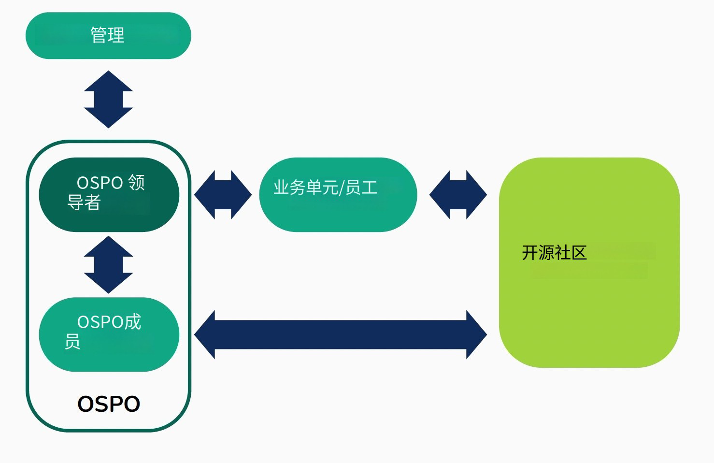

## 为员工和管理层带来范式转变的支持团队

索尼的OSPO涵盖了索尼的业务板块，包括半导体、电子、游戏以及影像相关行业。

当广（Hiro，高级OSPO联盟经理）和阿林（Alin，开源社区经理）加入团队时，开源工作是由一个由几位开源倡导者领导的虚拟委员会进行的，这是一种临时性活动，主要集中在法律风险管理和与法务及知识产权部门的协作上。该虚拟委员会制定了有关开源软件（OSS）使用的指导方针，包括许可证和贡献。经过数年之后，OSPO 得以正式成立，现在则继续并扩大开源工作。

索尼的OSPO经理久多正（Masa Kuwata）表示，OSPO概念的感知价值在于其能够带来一种范式转变，即从一个从事风险管理和支持工作的办公室转变为具有战略功能的部门。然而，挑战在于传播有关OSPO实际作用的观念和信息。

## OSPO 实践

### 索尼为什么需要OSPO？

该组织作为开源活动的中心，为员工和管理层带来范式转变。

### 索尼的开源项目办公室（OSPO）是什么？

卓越中心：

开源在组织内各个层级的整合，适应每个人的需求。为了实现这一点，OSPO通过多种方式提供内部教育，包括：

* 培训课程，如Linux基金会（LF）培训课程和内部培训课程。
* 内部开源活动。
* 创建内部社区，如开源软件（OSS）许可委员会和技术社区。
* 鼓励参与外部开源活动。
* 发布如 OSS 季度报告之类的通讯。

此外，OSPO还与开源项目和基金会紧密合作，以应对合规性、开源可持续性或安全挑战。

### 索尼的开源项目办公室（OSPO）组织架构设置？

 OSPO 相关人员为组织提供工作支持，并在不同层级上传播开源及其哲学的价值。

#### 管理层级

开源战略与业务战略的对齐。

#### OSPO 层

在集团内部推动OSPO的发展和OSPO网络的构建。

#### 员工层

推动文化变革，鼓励员工形成开源文化。

#### 业务部门

鼓励不同业务部门之间的协作，共享最佳实践。

### 索尼的开源项目办公室（OSPO）是如何运作的？

支持OSPO的人员通过不同渠道与各种内部和外部的开源参与者分享知识：

* 管理层、委员会和OSPO团队 ：每月会议。
* 雇员 ：咨询、内部网站、内部社交网络、开源季度报告以及内部开源活动。
* 员工 ：与法务部门和知识产权部门合作。
* 开源 ：在外部开源活动中分享最佳实践，在开源共同体（如TODO Group和OpenChain项目）中交流意见。

## 感悟

### 1    

一个开源项目办公室（OSPO）低估了开源社区对公司和社会的影响，类似于民主，忽视了它可能产生的积极和消极影响。

将开源战略的一个支柱建立在与开源社区的互动和建立有效的沟通计划上，以分析社区的健康状况和需求，并采取必要的行动来提供帮助。

### 2 

一个开源项目办公室（OSPO）仅仅专注于技术方面，忽视了社区协作。

**解决方案：**

建立一个真正的OSPO，它也拥抱社区方面。

### 3 

**问题：**

一个开源项目办公室（OSPO）分别处理安全和数据管理方面的挑战，没有将这些问题与开源哲学的广泛采用所引发的社会问题联系起来。

**解决方案：**

将社会问题纳入考量，这些问题是随着开源哲学的广泛采用而出现的。

### 4

**问题：**

一个开源项目办公室（OSPO）忽视了在公司内部和社会中实现开源软件战略利用和创造所需的必要文化和结构性变革。

**解决方案：**

投资于必要的培训、工具和其他手段，以应对文化变革，同时开展开源软件的技术整合工作。

### 5 

**问题：**

一个开源项目办公室（OSPO）希望避免内部和外部社区发展的不足。

**解决方案：**

认识到组织内部以及与外部世界和社会进行合作的必要性。