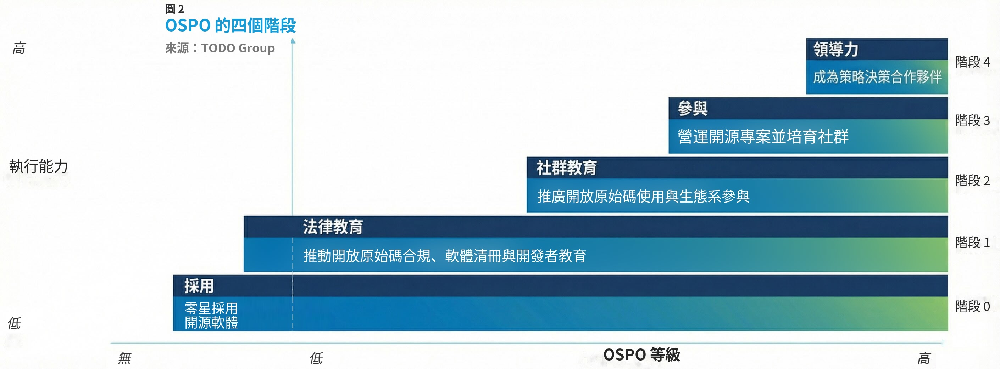

# 組織 OSPO 模型分類

這份文件預期會持續更新。目標是建立 OSPO 模型的分類方式，並找出有助於不同組織學習與實作的關鍵組成要素（模式）。

社群可以提出「五階段 OSPO 成熟度模型」的衍生版本，使其更符合特定垂直產業及地區的需求。

> 若想參與貢獻，請送出 PR。

## OSPO 模型 1：五階段 OSPO 成熟度模型

> 完整研究請參考 [OSPO 的演進](https://www.linuxfoundation.org/research/the-evolution-of-the-open-source-program-office-ospo)
>
> 若要進一步了解 OSPO 的特性、組織架構與角色，請參考[深入了解 OSPO](https://www.linuxfoundation.org/research/a-deep-dive-into-open-source-program-offices)

隨著 OSPO 數量增加並日益普及，這些計畫也逐漸成熟。我們將 OSPO 領導者與專家的訪談內容，對照 OSPO 調查結果，從而建立一套 OSPO 成熟度模型，用來描述 OSPO 的典型演進歷程。請注意，*沒有任何一套方法適用於所有組織*。事實證明，這套模型較適合原先並未在*日常營運*中慣常採行開放原始碼的環境。此外，組織的規模與類型也會影響 OSPO 的成熟方式。在大型組織中，不同事業單位可能會採取不同的開放原始碼作法，並各自形成不同的技術文化；完全以數位技術為核心的公司，則更有可能提早採用開放原始碼並做出貢獻，也更熟悉相關技術與概念。

**釐清 OSPO 模型**

OSPO 的層級取決於其執行能力。此外，各階段具有累積性。這表示 OSPO 在進入下一個層級後，仍須負責先前層級的任務與責任。

例如，當 OSPO 已完成開放原始碼合規與安全（階段 1）所需的全部任務後，便可能準備進入階段 2。此時，OSPO 除了持續處理階段 1 的開放原始碼法律責任，也要承擔階段 2 所新增的開放原始碼文化推廣及生態系參與工作。

## 0️⃣ 階段 0：零星採用開源軟體

現今幾乎所有組織都會使用開放原始碼軟體，但初期採用及使用方式各有不同。組織可能會把這類軟體當成產品或工具中的基礎元件或函式庫，也可能將其用於供應商產品堆疊的關鍵部分，或用來支撐供應商提供的服務。開發者可能運用開放原始碼軟體快速製作原型，或開發微服務與小型應用程式，也常採用整合式開發環境（IDE），或 GitHub、GitLab 這類建立在開放原始碼之上的開發工具。現代雲端原生應用程式幾乎預設會使用開放原始碼系統來處理容器編排、可觀測性、資料儲存、訊息傳遞等工作；前端應用程式也高度仰賴開放原始碼函式庫與框架。Red Hat 的報告指出，「90% 的 IT 領導者都在使用企業級開放原始碼」。Synopsys 等軟體成分分析供應商則發現，超過 75% 的程式碼庫含有開放原始碼元件。

換句話說，幾乎所有組織都在使用開放原始碼。然而，最初期的採用通常是由開發者運用容易取得的工具與技術來解決問題，零星進行且尚未形成正式流程。這種「零星採用」通常表示，除了預設條件外，組織很少考量授權合規，也很少思考採用開放原始碼，以及散布含有開放原始碼元件的產品，可能造成哪些長期影響。在多數情況下，只有少數工程師會主動尋找開放原始碼；工程組織中的其他人即使碰巧使用了開放原始碼，也不會認為自己的工作仰賴開放原始碼。因此，組織既沒有專責管理開放原始碼的集中團隊，也沒有組織層級的開放原始碼策略。然而，這兩者都十分重要，因為開放原始碼元件一經採用，就會自然成為組織軟體供應鏈的一部分，更凸顯從策略角度處理開放原始碼的必要性。

## 1️⃣ 階段 1：推動開放原始碼合規、軟體清冊與開發者教育

一般而言，當組織察覺各個工程與開發部門及職能都在使用開放原始碼產品與程式碼時，就會成立 OSPO。這類使用通常限於內部，並未成為提供給客戶或使用者的產品或服務。實際上，只要組織具有一定規模的 IT 職能，以及成熟的線上服務或以應用程式為核心的業務，就會使用開放原始碼，因為整個技術堆疊都少不了它，從 Linux 伺服器、MySQL 資料庫，到 NodeJS、Python 等程式語言，以及 React、Vue.js 等前端框架都是如此。

在這個早期階段，各組織常以不同名稱稱呼 OSPO。例如，IBM 最初將其有計畫的開放原始碼工作稱為「Open Source Steering Committee」。無論名稱為何，階段 1 的組織都已認知到開放原始碼是商業與技術策略的重要一環，也了解開源專案的安全實務與專有軟體公司的作法不同。例如，開源專案的揭露規則往往比專有軟體專案更嚴格，因此組織必須辨識自身面臨的法律與安全風險。降低風險的策略包括審慎處理授權、教育開發者，以及嚴謹盤點開放原始碼元件。

### 管理法律風險與授權

組織的法務團隊或技術主管通常會推動 OSPO 的階段 1 發展，確保員工（以及承包商、供應商等）都依照授權條款使用開放原始碼軟體，並避免組織因此承擔法律風險。目前通行的開放原始碼授權條款有數十種。在 2020 年的調查中，受訪者將合規列為大型企業成立 OSPO 的首要效益；對中型企業而言，合規也仍是第二重要的效益。公司剛開始處理這些問題時，通常會感到相當困惑。

開放原始碼使用者向來重視法律合規，但有些貢獻者設計了新的授權條款，以防止大型雲端服務供應商利用開源專案建立專有服務。其中最著名的是 GNU Affero General Public License（AGPL）。公司可以使用依照這項授權條款發布的開放原始碼軟體提供軟體即服務（SaaS）；如果公司修改程式，且修改後的版本支援使用者透過電腦網路與其遠端互動，AGPLv3 第 13 條便要求公司明確讓這些使用者有機會免費取得該版本的對應原始碼。許多企業還設有事業單位間的內部財務計費制度，使付費服務與內部服務之間的界線更加模糊；不過，AGPLv3 的這項義務並不以內部或外部交付作為主要判定標準。

### 教育開發者

為了維持合規，處於 OSPO 成熟度階段 1 的組織會建立教育方案，協助開發者判斷何時適合在新產品或服務中使用開放原始碼軟體。VMware 開放原始碼行銷與策略總監 Suzanne Ambiel 表示：「許多未接受開放原始碼教育的開發者認為，既然沒有購買軟體、也沒有簽署合約，就不存在授權問題。開放原始碼軟體可能是免費的——也就是無價的——但若使用方式不合規，也可能付出高昂代價。開放原始碼軟體一定附有授權條款。任何 OSPO 最重要的職責之一，就是確保開發者了解選擇不同授權條款的影響。」

透過開發者教育，高階管理者通常也會理解開放原始碼的價值與重要性。在這類方案中，開發者會學習：

* 不同授權類型之間的細微差異
* 引進新開放原始碼產品的正式核准流程
* 不合規使用開放原始碼軟體的實際風險，包括採用來自未提供正式授權條款之專案或程式碼的產品
* 使用貢獻者授權協議（CLA），規範組織內開發者對開放原始碼的貢獻

有些組織會在這個階段建立正式的 CLA 政策，也可能提供判斷開源專案健康狀況的指引，作為決定組織技術堆疊或基礎設施應採用哪些開放原始碼軟體的評估標準之一。

### 建立軟體清冊

開發者可能會臨時部署開放原始碼軟體，卻未有系統地記錄相關作業。法務團隊與技術主管通常會推動盤點組織使用的所有開源軟體，逐項列出組織程式碼儲存庫（例如 GitHub、GitLab）及系統中的相關元件。階段 1 的組織會建立明確的軟體清冊流程，產出全組織的軟體物料清單（SBOM）。有了這份清冊，法務團隊通常會與 OSPO 團隊合作，持續監控開源軟體的使用情況，並標示法律、安全或其他專案風險。詳細的 SBOM 也能協助技術長（CTO）、資訊長（CIO）等技術主管辨識並密切監控對業務最關鍵的使用情境，維護組織安全。

**本階段建議參與的開放原始碼社群**

| 橫向能力 | 專案／社群 |
| --- | --- |
| 合規 | OpenChain Project |
| 安全 | OpenSSF |
| | SPDX |

> 若要列出其他開放原始碼社群，請送出 PR。

## 2️⃣ 階段 2：推廣開放原始碼使用與生態系參與

組織認知到開放原始碼的價值，以及合規、教育與 SBOM 的必要性後，便會開始理解使用開源軟體所帶來的經濟效益，並設法擴大採用範圍。階段 2 的 OSPO 會建立各種內部機制，例如由推廣大使倡議使用已核准的開源產品、提供開放原始碼良好實務的教育方案，以及補助技術訓練或學費，協助員工培養開源技能並取得認證。組織可以藉由這些措施擴大開源軟體的使用，並強化一項訊息：開源軟體不僅重要，而且是比專有軟體產品更理想、更值得優先採用的選擇。

員工教育包括說明與開源專案互動的最佳實務，例如如何提出功能需求、回報錯誤，以及提交基本程式碼貢獻。在這個階段，組織會強化協作能力，親身體驗開源專案與社群的運作方式。此時，OSPO 會向員工與管理者傳達「不應只是使用開放原始碼，也應主動貢獻」的重要性。推廣工作包括倡議及推動活動贊助、安排專案負責人與維護者在公開程式設計論壇擔任講者或與談人，以及確保組織能為攸關任務成敗的開源專案投入人才、資金等資源。

對組織而言，積極且公開參與會帶來多項效益，包括提高能見度、改善聲譽，以及提升雇主吸引力。為此，許多非科技組織會在重要開放原始碼活動中租用攤位，以便與相關社群深入互動，並招募樂於在開源生態系中工作的開發者。積極參與開放原始碼的科技公司，也可能將教育方案提供給希望與開源社群及供應商互動的客戶。

隨著階段 2 持續發展，組織會開始提供誘因，鼓勵開發者投入對營運至關重要的開源專案，讓他們成為高度活躍的貢獻者，甚至是主要維護者。對科技組織而言，聘用知名開源專案的貢獻者是一項有價值的投資。以 Linux 核心為例，它是 Linux 作業系統的核心元件，也是電腦硬體與軟體之間的重要介面；其多數貢獻者都是全職員工（FTE），主要工作就是為 Linux 撰寫程式碼。

科技業以外能夠指派全職員工參與開放原始碼工作的組織較少，但仍有組織開始這麼做。例如，Comcast 與 Bloomberg 都有員工全職參與開源專案。在生命週期的這個階段，OSPO 會開始探索如何簡化開發者採用開放原始碼軟體的流程。提升開發效率的作法可能包括簡化 CLA、將授權類型可接受的開源軟體加入工單系統以加速核准、鼓勵重複使用既有開放原始碼架構與軟體（類似 InnerSource 的作法），以及將函式庫選擇與開放原始碼開發工具標準化，從而結合 OSPO 與平臺營運的職責。

OSPO 通常會在成熟度週期的階段 2，開始替開發者簡化及改善對外開放原始碼貢獻流程；如果公司以軟體或核心技術為主要業務，也可能早在階段 1 就開始進行。組織在早期通常以臨時方式申請及核准對外參與，不僅流程繁瑣，也會造成許多阻礙。

**本階段建議參與的開放原始碼社群**

| 橫向能力 | 專案／社群 |
| --- | --- |
| 社群健康度與指標 | CHAOSS |
| 內部開放原始碼文化 | InnerSource Commons |

> 若要列出其他開放原始碼社群，請送出 PR。

## 3️⃣ 階段 3：營運開源專案並培育社群

在階段 3，組織會發起開源專案，接著負責營運或擔任主要贊助者。組織會為專案投入一名或多名全職員工，並承擔培育專案社群及維持其健康度的責任。這種組織層級的投入，不應與員工個人決定將自己的專案開放原始碼混為一談。在階段 3，組織領導者會支援孵化開放原始碼專案並將其公開發布，因為他們了解這些專案能為組織帶來哪些效益。這類專案通常能改善關鍵能力的效能與經濟效益；這些能力或許不是組織價值主張的核心，卻對技術基礎設施至關重要。

此外，建立並發布開放原始碼專案的組織，能在開放原始碼社群中建立廣泛的公信力；對許多開發者而言，參與開放原始碼技術的機會也很有吸引力。我們訪談的大多數 OSPO 都將招募新工程人才與留住現有人才，視為投入開放原始碼的重要動機。

以全職員工與資金支援專案，代表組織真正投入開放原始碼。跨越這道門檻並成功發布多個開放原始碼專案的組織，會建立內部資源與流程，用來孵化專案並確保專案在發布後持續成功。OSPO 不只是專案成立與發布過程中的把關者及導師，也會教育專案建立者，使其了解培養健康開放原始碼生態系的必要條件，並指導專案負責人，協助他們做好準備，承擔開源專案所需的公開領導角色。

隨著組織的開放原始碼實務逐漸成熟，OSPO 會建立內部流程、操作手冊、檢查清單、工具與其他機制，用來審查、組織及營運開放原始碼專案，並培養及指導其領導者。有些 OSPO 偏好在主要開放原始碼基金會或 TODO Group 等協作組織協助下發布專案，以提升能力，或取得基礎設施、實務協助及其他資源。這種方式所需的內部資源較少，但也會將專案控制權交給更廣泛的社群。

**本階段建議參與的開放原始碼社群**

| 橫向能力 | 專案／社群 |
| --- | --- |
| 社群健康度與指標 | CHAOSS |
| 特定專案與傘型基金會 | Linux Foundation |
| | CNCF |
| | Eclipse Foundation |
| | Apache Software Foundation |

> 若要列出其他開放原始碼社群，請送出 PR。

## 4️⃣ 階段 4：成為策略決策夥伴

到達這個成熟階段後，OSPO 會成為技術決策的策略夥伴，協助引導技術選擇，並形塑對專案的長期承諾。在階段 4，技術長與其他技術主管會向 OSPO 及其領導團隊諮詢，了解應仰賴哪些開放原始碼技術，以及評估開放原始碼專案時應採用哪些決策標準。重大開放原始碼技術選擇通常會產生可觀的後續間接成本，並影響上游與下游技術及人力規畫，因此選擇開放原始碼專案也會成為重要的商業決策。

概括而言，OSPO 在階段 4 會提供三類策略指引。第一，OSPO 會建議技術長與技術主管，應將哪些開放原始碼技術納入組織的技術堆疊，又應移除哪些技術。現今開放原始碼選擇繁多，如圖 2 所示，多數主要軟體類別都有數十種選項；OSPO 因而能針對各種開放原始碼趨勢提供洞見，例如不同程式語言的普及程度、API 的設計方式，或不同 NoSQL 資料庫的功能。在這項角色中，OSPO 會成為技術長的內部技術顧問，以及組織內部的開放原始碼專家。

第二類策略指引是由 OSPO 主導建立判斷開源專案是否可接受的評估基準。OSPO 經常評估專案的行為與表現，尤其關注會限制使用的授權類型變更，或專案發展藍圖突然改變等情況，藉此判斷專案管理者是否以社群的最佳利益為考量。多數 OSPO 會使用概略指標來評估專案行為，例如：

* 專案採用哪一類授權條款？
* 專案的行為準則為何？違反準則會有什麼後果？
* 專案採用什麼治理架構？該架構能否確保獨立性？
* 專案需要多久才會回應 Pull Request 或錯誤回報？
* 專案發布新版本的頻率為何？
* 專案由單一方（公司或組織）控制，還是由整個社群共同管理？
* 專案有多少位貢獻者？人數如何隨時間變化？

第三類指引是協助組織了解並處理專案政治，例如在多個具有影響力的參與者試圖引導專案時維持中立，或說明社群成員未明說的政治考量。在更高層次上，OSPO 可以協助公司面對技術民族主義時保持中立，並透過培養跨越國界與政治領域的個人及工作關係，彌合政治分歧。隨著基金會與非營利組織成為開放原始碼領域重要的中立空間，這項價值也逐漸延伸到它們的工作。

**本階段建議參與的開放原始碼社群**

| 橫向能力 | 專案／社群 |
| --- | --- |
| 社群健康度與指標 | CHAOSS |
| 特定專案與傘型基金會 | Linux Foundation |
| | CNCF |
| | Eclipse Foundation |
| | Apache Software Foundation |

> 若要列出其他開放原始碼社群，請送出 PR。
